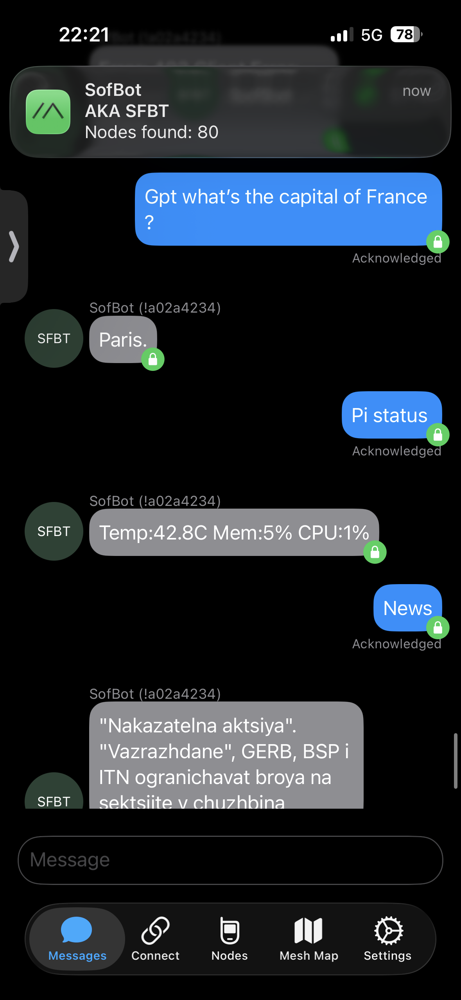

# SofBot

A Meshtastic mesh network bot that responds to direct messages with news and weather information.



## Features

- **ping** -- Simple connectivity check (replies "pong")
- **news [n]** -- Fetches latest headlines from Radio Svobodna Evropa (Bulgarian news)
- **weather [tomorrow]** -- Fetches weather forecast for Sofia from Open-Meteo API
- **pi status** -- Reports Raspberry Pi system stats (CPU temp, memory usage, CPU usage)
- **nodes** -- Shows count of known mesh nodes
- **gpt \<question\>** -- Ask an AI question (via OpenRouter, uses DeepSeek)
- **help** -- Lists available commands

All responses are transliterated from Cyrillic to Latin and truncated to 250 bytes to fit mesh radio constraints.

## Setup

```bash
python -m venv .venv
source .venv/bin/activate
pip install -r requirements.txt
```

## Environment Variables

- `OPENROUTER_API_KEY` -- Required for the `gpt` command

## Usage

Connect a Meshtastic device via USB, then:

```bash
export OPENROUTER_API_KEY="your-key-here"
python -m bot.main
```

The bot listens for direct messages and dispatches commands automatically. It will auto-reconnect if the device disconnects.

## Project Structure

```
bot/
├── main.py          # Entry point
├── commands/
│   ├── ping.py      # Ping command
│   ├── news.py      # News fetching command
│   ├── weather.py   # Weather fetching command
│   ├── pi_status.py # Raspberry Pi system status
│   ├── nodes.py     # Mesh node count
│   ├── gpt.py       # AI chat via OpenRouter
│   └── help.py      # Help command
└── core/
    ├── mesh.py      # Meshtastic device interface
    ├── router.py    # Command dispatcher
    └── text.py      # Transliteration and text utilities
```
